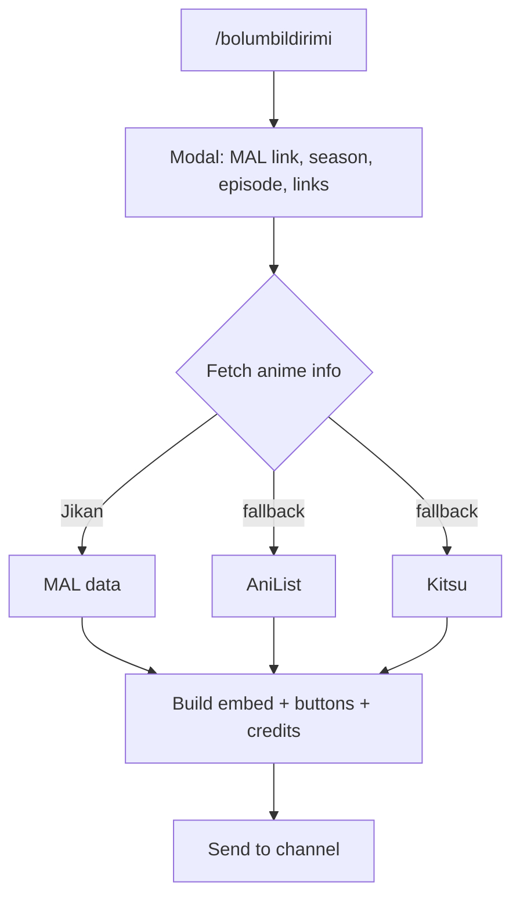
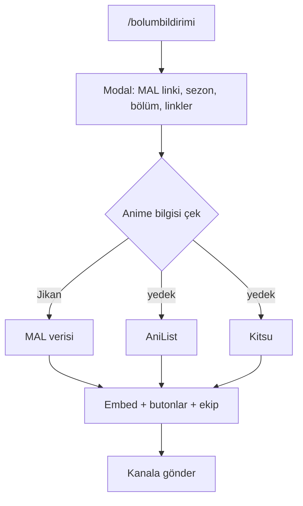

# LuminaSubs Bot

Discord episode-notification bot for the LuminaSubs fansub community.

## Features

- `/bolumbildirimi` command opens a modal: MAL link, season, episode, release links
- Anime metadata (title, studio, year, score, cover image) resolved via Jikan → AniList → Kitsu fallback chain
- Auto-generated embed with per-site release buttons and optional role mention
- Optional team credits: Translator, Proofreader, Encoder, Uploader — shown in a single embed field

## Flow

## Commands

| Command | Description |
|---|---|
| `/bolumbildirimi` | Episode notification: anime info, release links, optional team credits |

## Data

| File / Store | Purpose |
|---|---|
| `utils/pendingData.js` (in-memory) | Holds team-credit user IDs between command invocation and modal submit |

## Stack

Node.js, Discord.js v14+, Some API

## Contact

- LuminaSubs: [LuminaSubs](https://luminasubs.manus.space/)
- Discord: `wzlm`

---

# LuminaSubs Bot (Türkçe)

LuminaSubs fansub topluluğu için bölüm bildirim botu.

## Özellikler

- `/bolumbildirimi` komutu modal açar: MAL linki, sezon, bölüm, yayın linkleri
- Anime bilgisi (isim, stüdyo, yıl, puan, kapak) Jikan → AniList → Kitsu yedek zinciriyle çekiliyor
- Siteye özel butonlar ve isteğe bağlı rol etiketlemesiyle otomatik embed
- İsteğe bağlı ekip etiketleri: Çevirmen, Redaktör, Encoder, Uploader — tek embed alanında

## Akış

## Komutlar

| Komut | Açıklama |
|---|---|
| `/bolumbildirimi` | Bölüm bildirimi: anime bilgisi, yayın linkleri, isteğe bağlı ekip etiketleri |

## Veri Dosyaları

| Dosya / Depolama | Amacı |
|---|---|
| `utils/pendingData.js` (bellek içi) | Komut çağrısı ile modal gönderimi arasında ekip kullanıcı ID'lerini tutar |

## Teknolojiler

Node.js, Discord.js v14+, Bazı API

## İletişim

- LuminaSubs: [LuminaSubs](https://luminasubs.manus.space/)
- Discord: `wzlm`