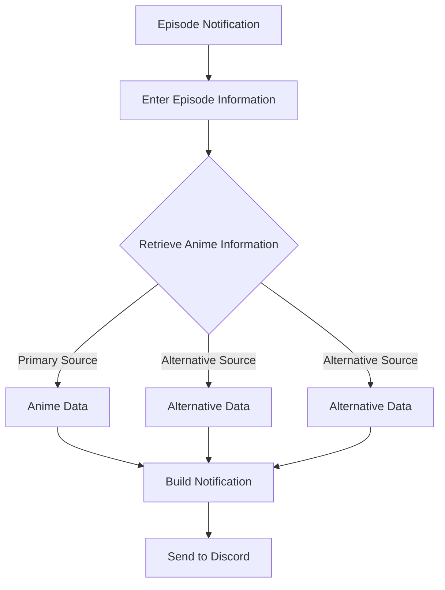
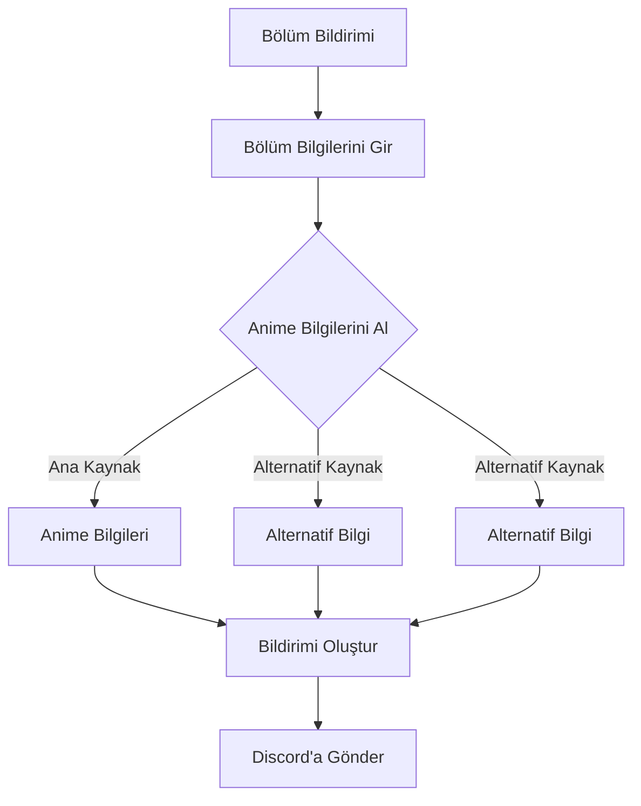

# LuminaSubs Bot

Discord üzerinden anime bölüm bildirimleri oluşturmak için LuminaSubs fansub topluluğu için geliştirilmiş özel bir Discord botudur.

[English](#english) · [Türkçe](#türkçe)

> The source code of this project is private. This repository only documents it.

> Bu projenin kaynak kodu özeldir. Bu repo sadece projeyi anlatır.

---

## English

LuminaSubs Bot is a private Discord bot designed to simplify the process of announcing newly released anime episodes within the LuminaSubs community.

It allows authorized users to prepare an episode announcement and publish the relevant information in a standardized Discord embed.

### Features

* Anime episode announcement system
* Automatic retrieval of available anime information
* Standardized Discord embeds
* Release links presented through dedicated buttons
* Optional role notifications
* Optional team credits
* Support for translation, proofreading, encoding, and uploading credits

### Flow

The general workflow can be summarized as follows:

A user starts the episode notification process and provides the required episode and release information.

The bot then retrieves available information about the anime and combines it with the submitted release details.

The resulting information is presented as a Discord embed containing the relevant episode information and release links.

When configured, team members involved in the production can also be included in the announcement.

### Episode Announcements

The bot is designed to keep episode announcements consistent across the server.

An announcement may contain information such as:

* Anime title
* Season and episode
* Cover artwork
* Studio and general anime information
* Episode release links
* Team credits
* Optional Discord role notification

The information displayed may vary depending on the available data.

### Release Links

Multiple release links can be included in the same announcement.

These links are presented through Discord buttons, allowing users to access the corresponding release locations directly from the announcement.

### Team Credits

An episode announcement can optionally include the members involved in the production process.

Supported roles include:

* Translator
* Proofreader
* Encoder
* Uploader

This allows the completed release to credit the relevant members within a single announcement.

### Anime Information

The bot can retrieve general anime information automatically rather than requiring all details to be entered manually.

The system is designed to use alternative information sources when the primary source does not provide the required information.

### Privacy

The source code and internal implementation of the project are private.

This repository only documents the general purpose and user-visible behavior of the bot. Internal implementation details, data structures, and integration details are intentionally not documented here.

### Project Status

**Private Project**

The bot is developed for the LuminaSubs community and is not distributed as a public Discord bot.

### Contact

* LuminaSubs: [LuminaSubs](https://luminasubs.manus.space/)
* Discord Sunucusu: [Sunucu](https://discord.com/invite/akzHAQ2Dh6)
* Discord: `wzlm`

---

## Türkçe

LuminaSubs Bot, LuminaSubs fansub topluluğu içerisinde anime bölüm bildirimlerinin hazırlanmasını ve Discord üzerinden düzenli şekilde paylaşılmasını kolaylaştırmak amacıyla geliştirilmiş özel bir Discord botudur.

### Özellikler

* Anime bölüm bildirim sistemi
* Anime bilgilerinin otomatik olarak alınması
* Standart Discord embedleri
* Yayın bağlantılarının özel butonlarla gösterilmesi
* İsteğe bağlı rol etiketleme
* İsteğe bağlı ekip bilgileri
* Çevirmen, redaktör, encoder ve uploader bilgilerinin gösterilmesi

### Akış

Genel çalışma mantığı şu şekilde özetlenebilir:

Kullanıcı bölüm bildirim sürecini başlatır ve gerekli bölüm ile yayın bilgilerini girer.

Bot daha sonra anime hakkında mevcut bilgileri alır ve gönderilen yayın bilgileriyle birleştirir.

Ortaya çıkan bilgiler, bölüm bilgilerini ve yayın bağlantılarını içeren düzenli bir Discord embed'i olarak kanala gönderilir.

İsteğe bağlı olarak bölümün hazırlanmasında görev alan ekip üyeleri de bildirime eklenebilir.

### Bölüm Bildirimleri

Bot, sunucudaki bölüm bildirimlerinin belirli ve düzenli bir yapıda hazırlanmasını sağlar.

Bir bildirimde şu bilgiler bulunabilir:

* Anime adı
* Sezon ve bölüm bilgisi
* Kapak görseli
* Stüdyo ve genel anime bilgileri
* Yayın bağlantıları
* Ekip bilgileri
* İsteğe bağlı Discord rol etiketi

Gösterilen bilgiler mevcut verilere göre değişebilir.

### Yayın Bağlantıları

Bir bölüm bildiriminde birden fazla yayın bağlantısı bulunabilir.

Bu bağlantılar Discord butonları üzerinden sunulur ve kullanıcıların ilgili yayınlara doğrudan ulaşmasını sağlar.

### Ekip Bilgileri

Bölüm bildirimine isteğe bağlı olarak bölüm üzerinde çalışan ekip üyeleri eklenebilir.

Desteklenen görevler:

* Çevirmen
* Redaktör
* Encoder
* Uploader

Böylece yayın içerisinde görev alan kişiler tek bir bildirim üzerinden belirtilebilir.

### Anime Bilgileri

Bot, gerekli genel anime bilgilerini otomatik olarak alabilir. Böylece bildirim hazırlanırken tüm bilgilerin manuel olarak girilmesine gerek kalmaz.

Ana bilgi kaynağında gerekli verilerin bulunmaması durumunda alternatif kaynaklardan yararlanılabilecek şekilde tasarlanmıştır.

### Gizlilik

Projenin kaynak kodu ve dahili çalışma yapısı özeldir.

Bu repository yalnızca botun genel amacını ve kullanıcı tarafından görülebilen çalışma şeklini açıklar. Dahili uygulama ayrıntıları, veri yapıları ve entegrasyon bilgileri özellikle dokümantasyon dışında tutulmuştur.

### Proje Durumu

**Özel Proje**

Bot, LuminaSubs topluluğunun kullanımı için geliştirilmiştir ve herkese açık bir Discord botu olarak dağıtılmamaktadır.

### İletişim

* LuminaSubs: [LuminaSubs](https://luminasubs.manus.space/)
* Discord Server: [Server](https://discord.com/invite/akzHAQ2Dh6)
* Discord: `wzlm`